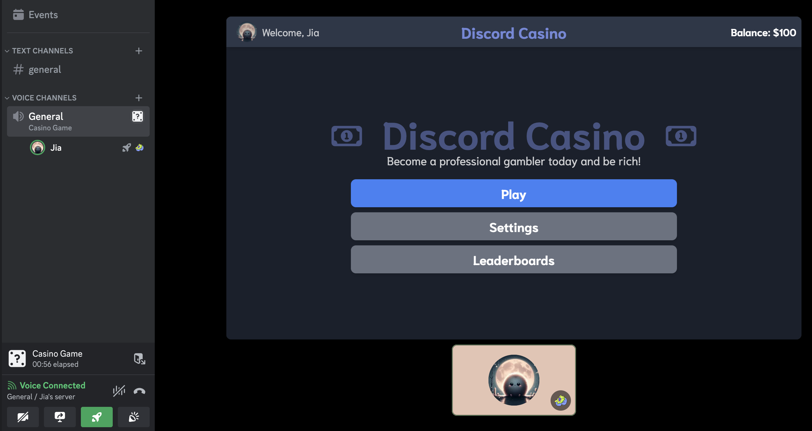

# Discord Casino

**Note: I don't condone gambling, and this is just a fun project for learning purposes.**

A minimalist example of a Discord activity, as a simple casino game with **fake currency**. Developed using Discord's Embedded App SDK and SvelteKit.

Stats are synchronized across sessions using a JWT token, and actions are sent to the server to process game logic.




## How to run

Create a new application on [Discord's Developer Portal](https://discord.com/developers/applications), and retrieve the client ID and client secret. Create the activity afterwards.

Create a new .env file in the root directory of the project and add the following:

```toml
# Discord
PUBLIC_DISCORD_CLIENT_ID=1234567 # App client ID
DISCORD_CLIENT_SECRET=abcdef # App secret

# JWT
JWT_SECRET=good-jwt-secret # Key for JWT
```

### Running the application

```bash
yarn
yarn dev
```

### Running the tunnel

Use cloudflare tunnels to expose the local server to the internet, then add a URL mapping with the new URL into the activity settings of the portal.

```bash
cloudflared tunnel --url http://localhost:5173
```
